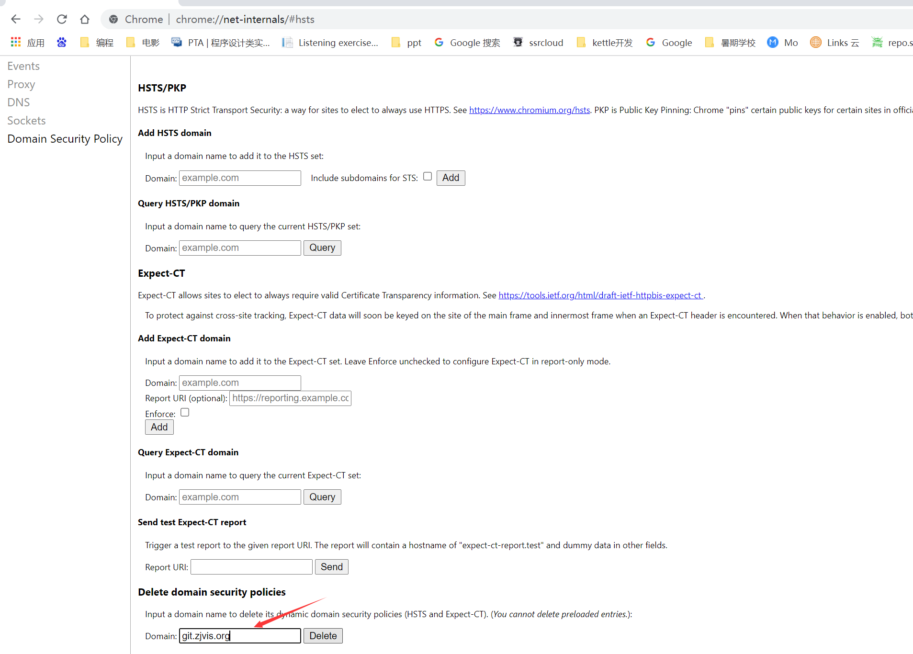
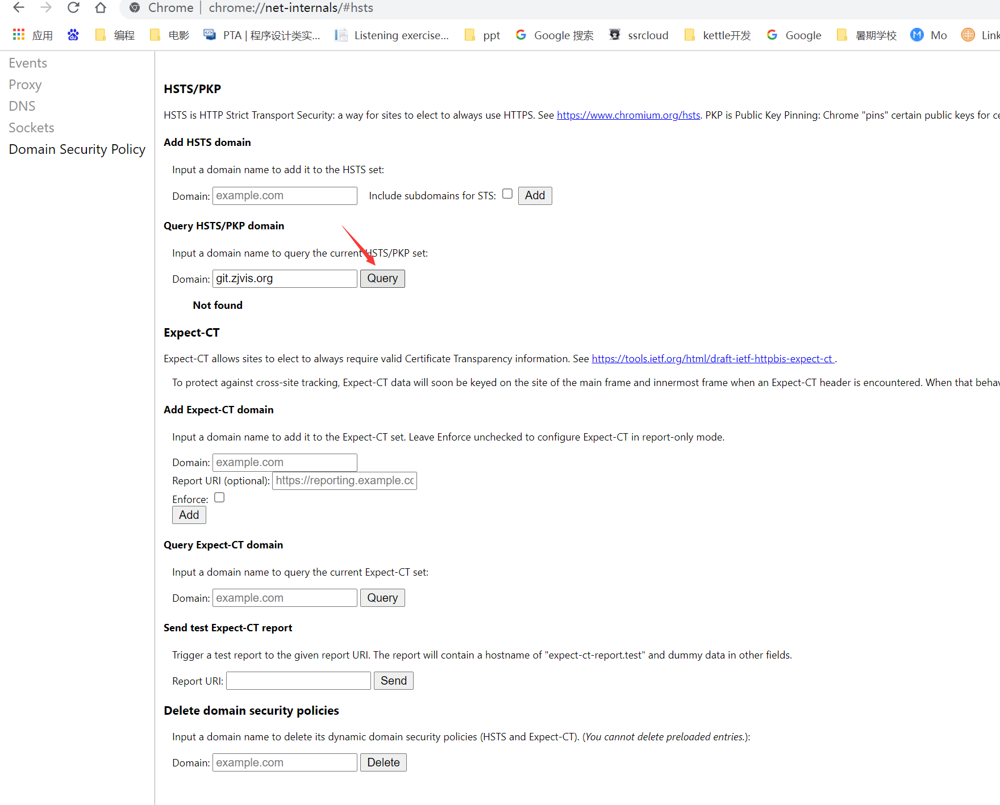
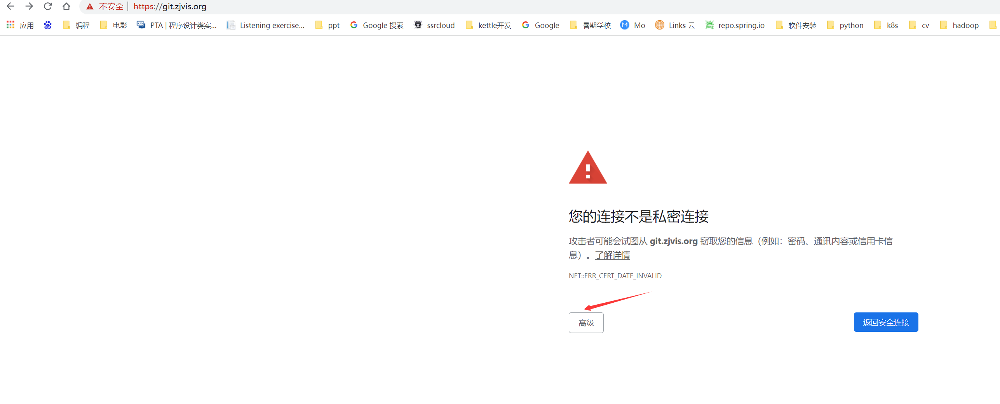

### How to access the website if the certificate expires

#### chrome 访问
1. chrome打开 chrome://net-internals/#hsts

2. Delete domain security policies

* 输入 `git.zjvis.org`, `cf.zjvis.org` 等以`zjvis.org`结尾的域名，点击`delete`删除
* 

3. Query HSTS/PKP domain

* 输入以`zjvis.org`结尾的域名，点击query，查看显示`not found`
* 

4. 打开需要访问的网站，在页面空白处单击，输入 `thisisunsafe`,即可访问

5. 再次访问出现问题，可以点开高级，继续前往访问页面
* 