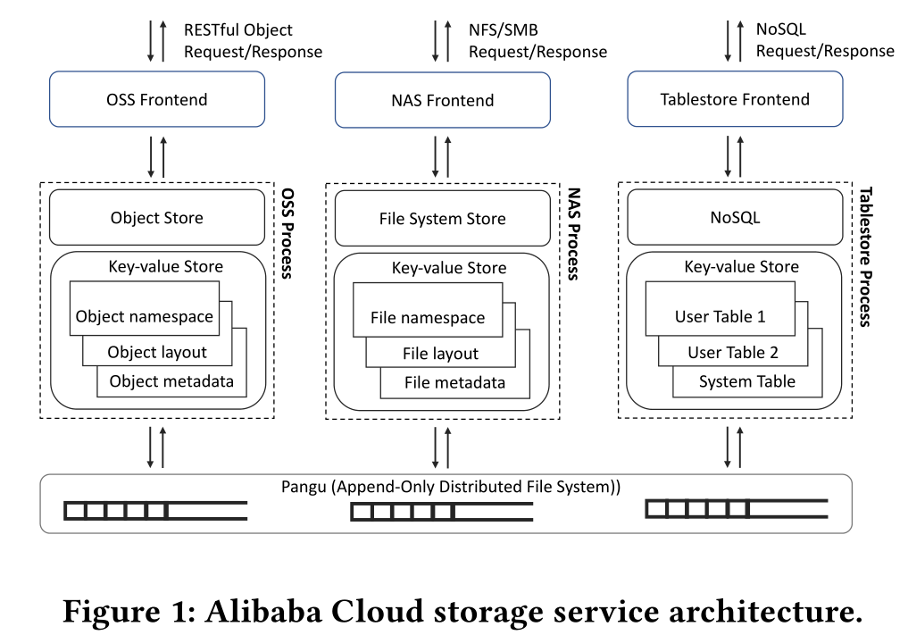
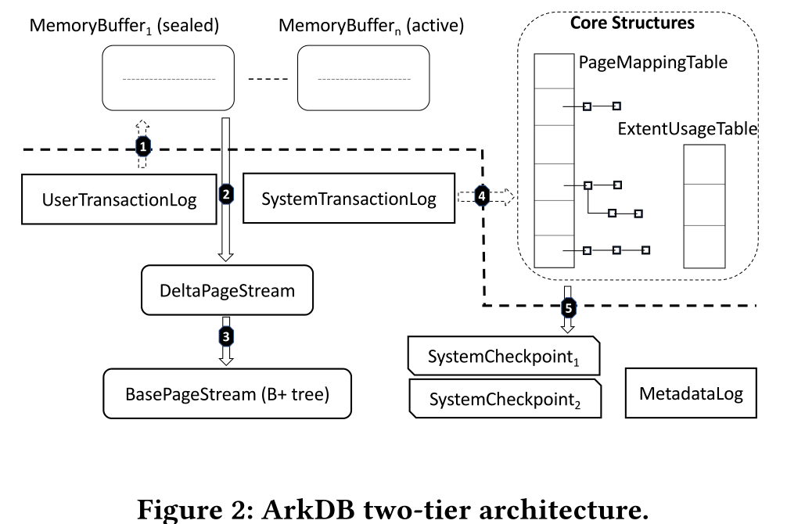
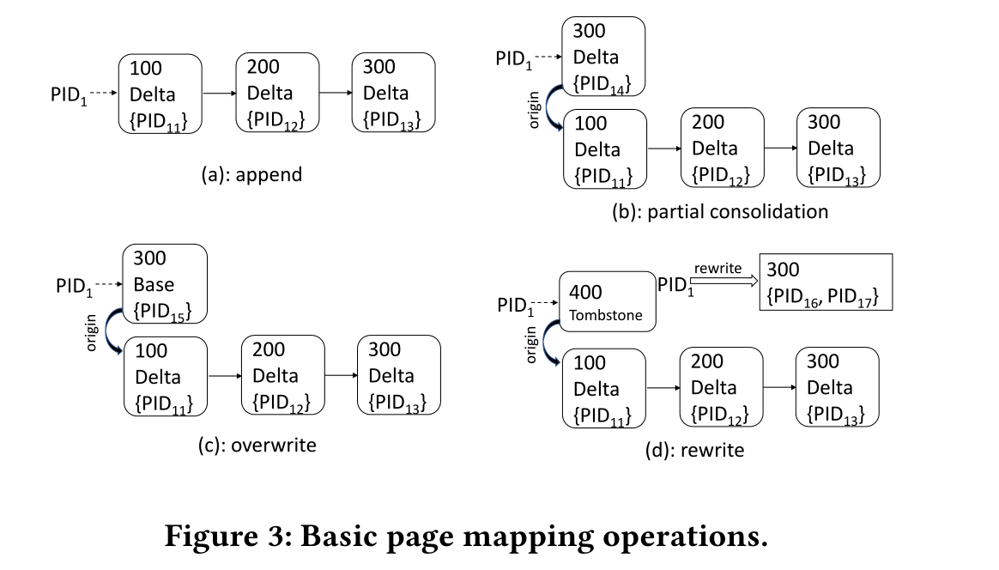

### ArkDB

#### authors 

alibaba

ACM SIGMOD 数据管理国际会议 在数据库领域具有最高学术地位的国际性学术会议

#### background 

* 

*  consisting of three independently scalable layers
    + a stateless frontend layer that handles user requests
    + a service layer that provides service logic backed by a distributed key-value store
    + a persistence layer built on an append-only distributed file system named Pangu
    
* In this paper, we focus on the design and implementation of the embedded key-value engine in a service process, the central component of the distributed key-value store.
  服务流程中嵌入式键值引擎的设计和实现, 分布式键值存储的核心组件
  
* Requirements and Challenges
    + Append-Only Distributed Persistence Layer
        * more cost-effective and better tailored for load balancing
        * small random writes are still much slower than large sequential writes and also incur very costly internal fragmentation that shortens SSDs’ lifespan 
    + Range Queries
        * Many index structures, while great at point lookups, provide limited range query performance.
    + Write-Dominant Workloads
        * It is mandatory to provide consistent write performance, which is made challenging by background data compaction and garbage collection on append-only storage.
    + Scalability
        * demand efficient partition split and merge for load balancing.
        * multiple read-only replicas need to be maintained efficiently without extra data copies
    + Availability
        * fast recovery for high availability.
    + Resource Efficiency
        * data accesses are often skewed and most data remain cold, engine should adapt to resource constraints.

* Existing Index Technology        
    + LSM Tree
      data are written to the storage sequentially as a new index file
      compaction activities result in significant write amplification, and often affect user experience.
    + Bw-Tree 
      Bw-tree maintains an in-memory mapping table that maps pages to memory addresses or storage locations
    + The ArkDB
      LSM tree-based key-value engine  does not offer fast range queries due to read amplification from iterating data scattered indifferent files.
        * Two-Tier Architecture
          The memory tier buffers newly ingested data. 
          The storage tier maintains an on-storage Bw-tree.   
          combines the advantages of LSM tree and Bw-tree.
        * Shrinkable Page Mapping Table
          In ArkDB, after a page is completely compacted with its index updated in the parent page, the corresponding page mapping entries can be removed.
        * Two-Level Logging and Recovery
          simplified from a traditional B+ tree based storage engine
        * Two-Level Snapshot
          delta chains are enhanced to two dimensions.
        * Hot-Cold Data Separation
          make GC more effective
        * Lightweight Partition Split and Merge
          file system hard-linking capability is utilized to avoid data replication during partition split/merge.
          lightweight cutting and stitching enable efficient partition split/merge that the original Bw-tree design lacks.

#### FUNCTIONAL SPECIFICATIONS

* Data Access Semantics
     + update, point lookup and ordered range scan
* Append-Only Distributed File System
     +  file stream can be hard-linked to another, with the extents shared.

#### ENGINE ARCHITECTURE

* 
* DeltaPageStream and BasePageStream together with PageMappingTable form an on-storage Bw-tree, a B+ tree variant on append-only storage with delta pages 
* ExtentUsageTable, is consulted during garbage collection of DeltaPageStream and BasePageStream

#### CORE DESIGNS

* no existing approach can shrink such a page mapping table efficiently to keep its memory footprint small 
* the page’s oldest location and some other statistics need to stay in memory, otherwise, garbage collection may incur a significant performance penalty.

*  ArkDB addresses the core challenge of maintaining a B+ tree with delta pages efficiently on append-only storage in two ways:
    +  maintaining a shrinkable page mapping table with concurrent user checkpoint, page compaction and tree structural changes
    +  collecting garbage efficiently by tracking valid data with a
    +  small memory footprint, and by separating hot-cold data streams to reduce write amplification induced by garbage collection.
    
##### Page Mapping Maintenance
* System Transaction Concurrency
    + Concurrent changes to the B+ tree structure are coordinated by page level locking
* Basic Page Mapping Operations
    + 
* Conflict Reconciliation
* Tree Structural Changes
    +  With page level locking, multiple tree structural changes can run in parallel.
##### Garbage Collection
* A key challenge arising from append-only storage is garbage collection
    + pages eventually become garbage when no active transactions depend on them.
    + separation of hot data from cold data reduces write amplification induced by GC
* Extent Usage Tracking
* Page Relocation
* GC Flow 

#### IMPLEMENTATION AND OPTIMIZATIONS

##### Two-Level Snapshot

* solation without the need of embedding a version number in each key-value on storage
* eliminates the corresponding space overhead on storage and in memory when the key-values are loaded into the cache
* ArkDB has two timestamp generators for user and system transactions respectively.

* Timestamp Correlation across Levels
* Snapshot Queries

##### Two-Level Restart Recovery

##### Read-Only Replica Continuous Recovery

##### Lightweight Partition Split and Merge
* Pre-Split/Merge Preparation
* Split/Merge Enhanced Restart Recovery
* Post Recovery Processing.

##### Caching

* delta page cache implements the FIFO replacement policy

#### PERFORMANCE EV ALUATION

designed to work on Pangu but can also use a local file system for testing and evaluation.

##### Experimental Design

##### Improvements over Bw-tree Design

compare ArkDB’s behavior against Bw-tree’s original design.

##### Comparison with LSM tree

measure the throughput of ArkDB and RocksDB with the Ingest-Only workload

##### Performance on Pangu

does not scale fully linearly due to contention on the hosting server CPU and on network access to the disaggregated storage

#### related work
* LSM tree
* B+ tree on log structured storage