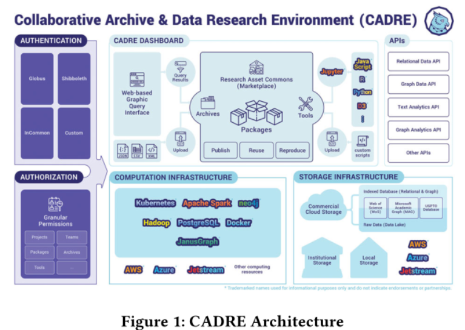
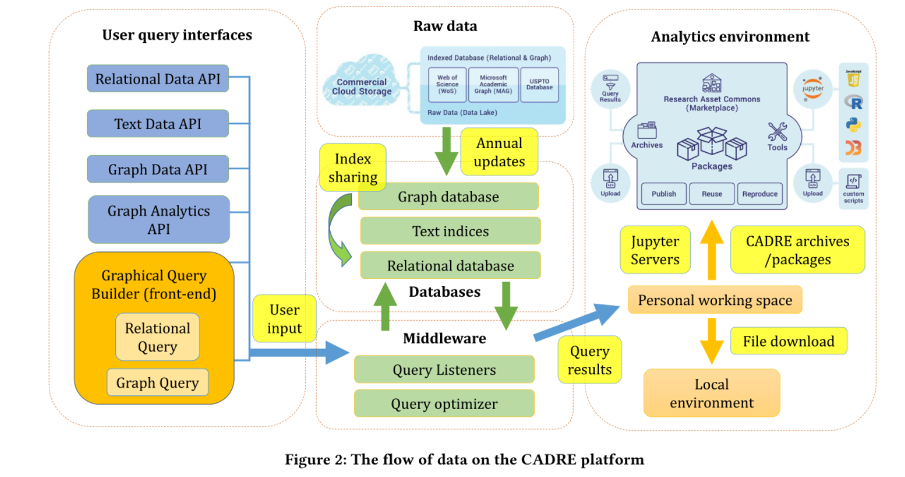
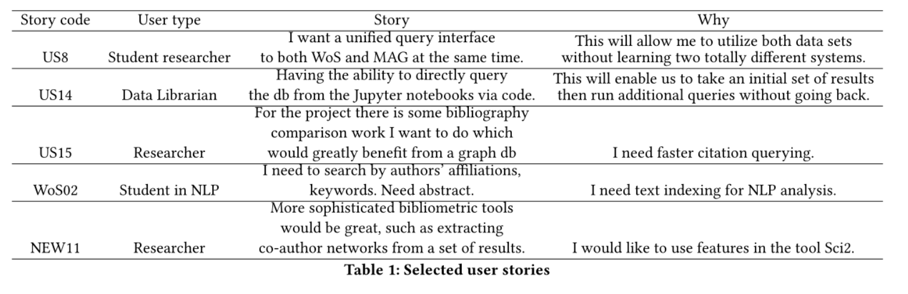
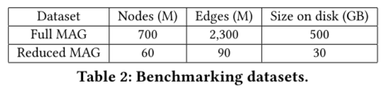
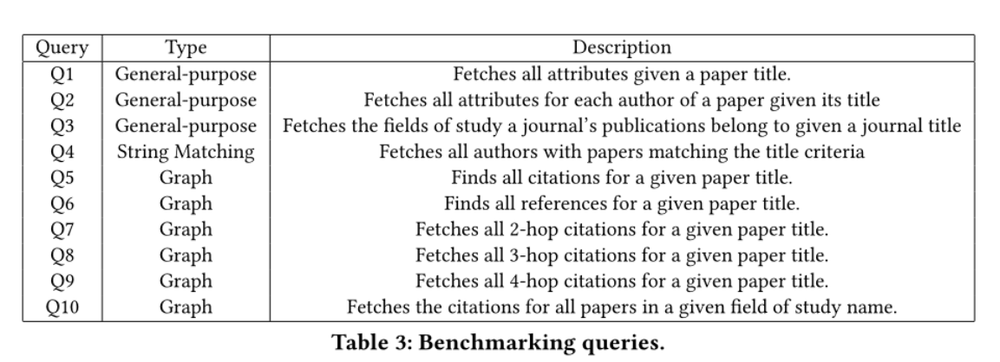
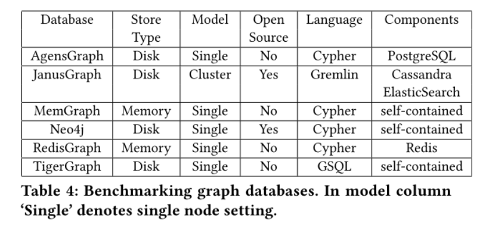
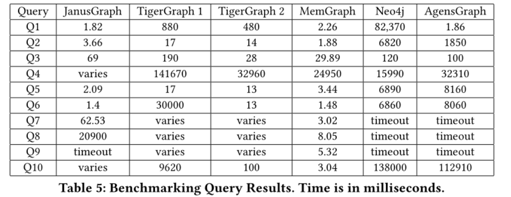

### What does this paper want to introduce?

A cloud-based data system consisting of scalable graph and text-indexed query engines
1. for non expert user, graphical user interface 
2. for advanced users, a scalable notebook service 

### Why to do this

1. Large bibliographic data sets hold the promise of revolutionizing the scientific enterprise when combined with state-of-the-science computational capabilities.
2.  hosting proprietary and open big data sets poses significant difficulties for libraries, both large
and small.
    * Infrastructure cost and expertise
    * Proprietary access restrictions
    * Data cleaning and other data custodial tasks.
    * Data updates and maintenance.
    * Enabling big data analytics
    * Facilitating access for patrons without advanced programming abilities.

  As a result  this makes it very challenging for the research community to reproduce, validate,and build upon previous results.

### how to do 

#### similar work

* Science gateways  - authentication and authorization schemes
* HathiTrust Research Center - scalability and providing a robust environment with analysis tools
* The NORC Data Enclave -  legal and ethical restrictions on data access
* The Cloud Kotta framework - a useful model for managing analytics tasks via a queue.
* Citation networks and other bibliometric analyses

#### lessons from previous Implements

* The centralized model is crucial for solving volume challenges in big data
* Shared cloud storage avoids duplicate data storage and multiple versions of the same data. 
* Combined with a fully featured data analytical environment, it adheres to a more efficient model of “Moving Computation to Data”, minimizing unnecessary data movements.

* previous experiments 
   + storing all of the data in a PostgreSQL database - rapid text searching but slowly exact citation networks, recursive querying
   + maintained most of the data in the PostgreSQL table but extracted all the data from the citation arrays and built a separate graph database using Neo4j. - significant technical challenges in allowing both database systems to communicate

* conclusion
   single PostgreSQL installation and a hybrid PostgreSQL and Neo4j system was that neither system could
   deliver both the rapid query response combined with the ability to support complex network queries.

#### The CADRE DATA ARCHITECHTURE

* 

* a federated authentication and authorization system

* cloud computational and storage infrastructures

* API and user interface

* focus on data pipeline, statis two data processing scenarios
  
    + 
    
    + Efficient and easy to use data query and analytical services for end users.
      
        * 
        *  "US8" and "US14, designed a set of user query interfaces
        * "US15", unified under the property graph data model
        * "WoS02", casting different entities and relationships as collection of nodes connected by edges
        *  "NEW11.", promote community sharing and collaborations
        
    + Bulk data ingestion with provenance for the technical team.
    
        +  all three data sets have an annual update cycle
    
#### Data Backends 

* aims to respond to complex graph queries in real time

* Graph databases are optimized for the property graph data model

* graph databases often provide implementations for common graph metrics and algorithms used to analyze citation networks,or languages and constructs that make the implementations of such easier for the user.

* Some graph databases also provide functionality commonly found in a traditional RDBMS such as indexing and efficient text search.

* Metrics

  + Scalability (high): The capability to host gigantic graph of millions of nodes and billions of edges.
  + Text search (high): The capability to support both plain string and full text search against graph node and edge attributes.
  + Graph query performance (high): The performance of the graph database on general-purpose and graph traversal queries.
  + Cost effectiveness (high): Both the operational cost and software license cost to run the graph DBMS and the middleware built around it.
  + Graph algorithm support (medium): The availability of implementations of common graph metrics and algorithms, such as closeness centrality, largest connected component, label propagation, cycle detection, shortest path, modularity, PageRank, HITS.
  + Ingestion (low): The time needed to populate each dataset
    in the graph database.

* benchmarking datasets

  

* benchmarking queries

* Performance comparsion

  we deployed each database to achieve its best performance given its architecture and the CADRE requirements.

  + Architecture
  + setup
  + cost
  + ingestion
  + query performance
  
  + 

  + 

* Chose JanusGraph 

  +  can not answer queries ask for exact number of nodes or edges for a specific node or edge type
  +  node and edge counts can be easily precomputed as a byproduct of the ingestion process and stored as graph metadata independent of the graph database

#### FRONTEND AND MIDDLEWARE

* a graphical query builder following the traditional bibliographic search boxes

* designed dedicated network queries where multi-hop citations can be efficiently extracted.

* frontend - vue.js

* middleware-  flask micro-framework
    + middleware plays a central role in communicating and coordinating different parts of the platform.

An asynchronous approach is used for the dataset queries so that the requests do not block other middleware services.

User queries are specified within the JSON message using a list of filters that are to be applied to node fields.

#### ANALYTICS DOWNSTREAMS

CADRE allocates each user their personal containerized Jupyter notebook server to analyze results from queries.

#### The Package System

designed to facilitate the sharing and reproduction of data, code or their combinations. 

#### Conclusion

* detailed the data pipeline of the CADRE platform,which provides an integrated cloud environment for large scale bibliographic data analysis.

### Feature Work

*  developing a public API ,  so that users can formulate and submit queries, retrieve results, and perform analysis all in one place.
*  streamlined package publication and sharing system

