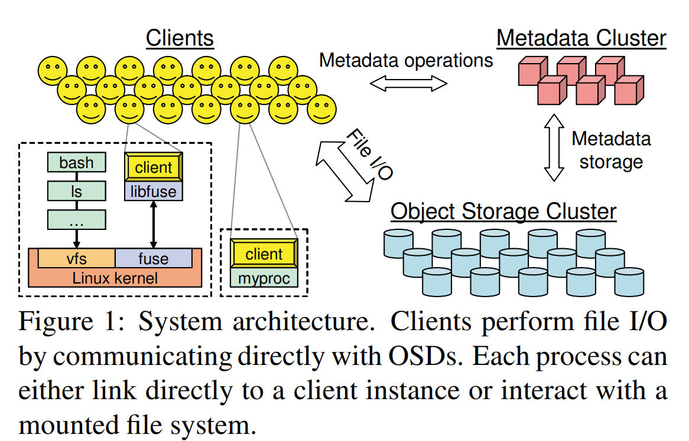
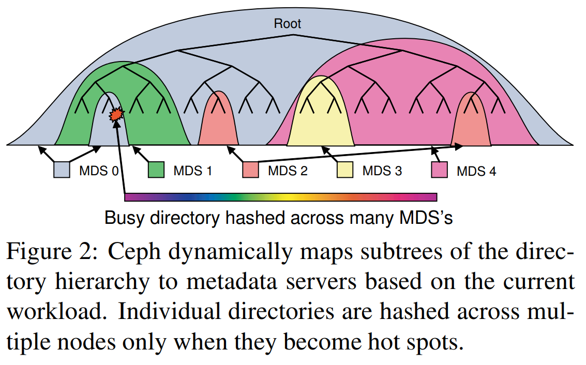
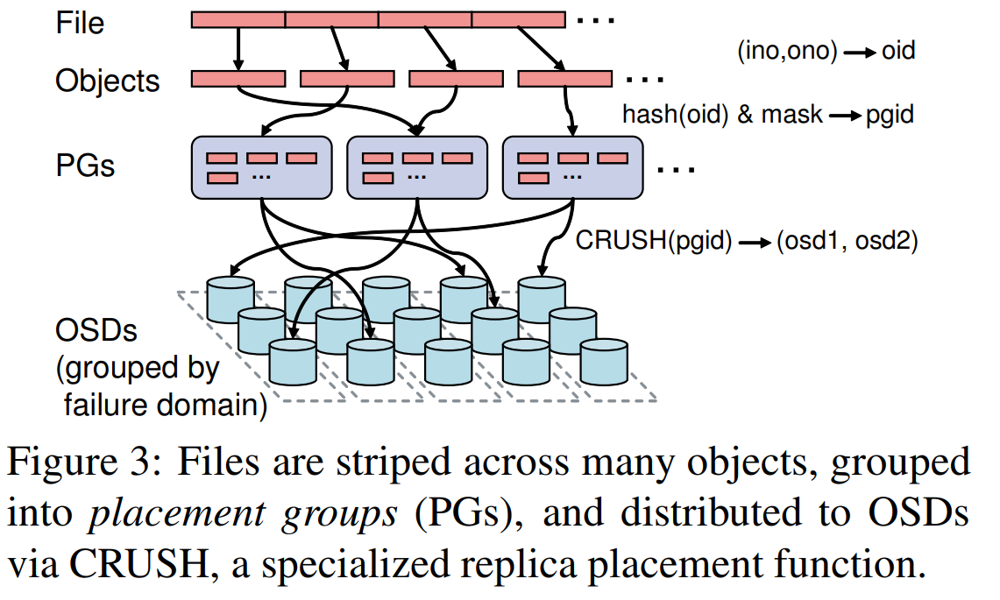
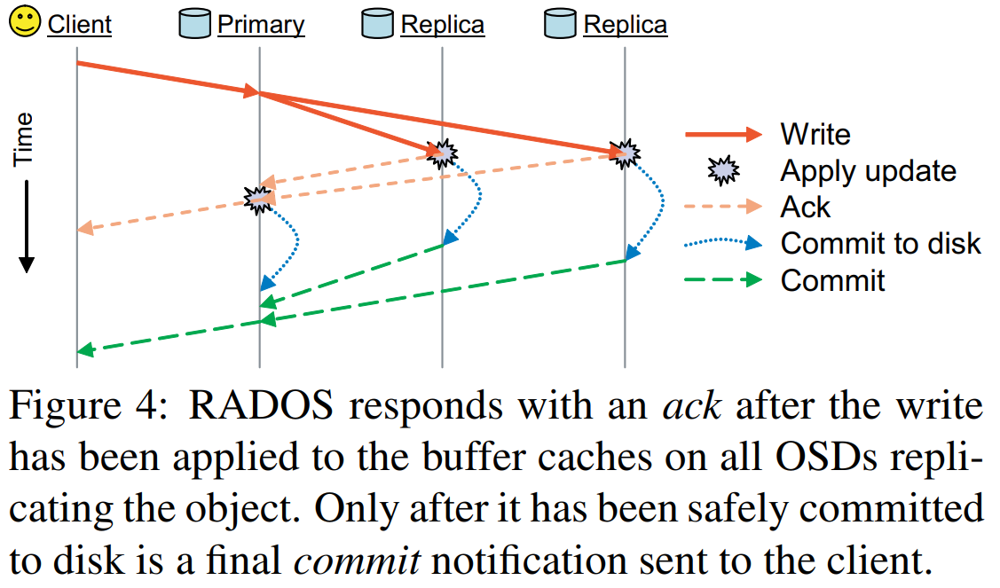

### CEPH
* A Scalable, High-Performance Distributed File System

#### authors

Sage Weil (born March 17, 1978) is the founder and chief architect of Ceph, a distributed storage platform

OSDI是计算机学界最顶级学术会议之一,操作系统领域的世界顶级会议

#### background 

* We have developed Ceph, a distributed file system that provides excellent performance, reliability, and scalability. 

* Traditional solutions, such as nfs, has proven a significant obstacle to scalable performance.

* object-based storage, in which conventional hard disks are replaced with intelligent object storage devices, limitations due to little or no distribution of the meta data workload.

#### system overview 

how to realize scalability、 high performance, reliability and availability simultaneously 

* 
* decoupled data and metadata
* dynamic distributed metadata management
* reliable autonomic distributed object storage.

#### client operations

* file I/O and capabilities
* Client Synchronization
* Namespace Operations

#### Dynamically Distributed Metadata

* Metadata Storage
* Dynamic Subtree Partitioning
    + 
* Traffic Control
   

#### Distributed Object Storage

* Data Distribution with CRUSH
    + 
* Replication
* Data Safety
    + 
* Failure Detection
* Recovery and Cluster Updates
* Object Storage with EBOFS
    ext3 interface and performance to be poorly suited for object workloads

#### Performance and Scalability Evaluation

* Data Performance
    + OSD Throughput
    + Write Latency
    + Data Distribution and Scalability

* Metadata Performance
    + Metadata Update Latency
    + Metadata Read Latency
    + Metadata Scaling
    
#### Related work

Although many file systems attempt to meet the need that  place a heavy load on the file system they do not provide the same level of scalability that Ceph does.

* OceanStore and Farsite - cannot provide high-performance access to a small set of files by tens of thousands of cooperating clients 
* GPFS  and StorageTank - are limited by their use of block-based disks and their metadata distribution architecture.

#### Experiences

CRUSH was able to deliver the necessary scalability, flexibility, and reliability.
EBOFS was surprisingly quick to develop in user-space, offered very satisfying performance, and exposed an interface perfectly suited to our requirements.
MDS load balancer to overall scalability
client interface posed a greater challenge than anticipated

#### Future Work

Ceph elements have not yet been implemented, including MDS failure recovery and several POSIX calls.