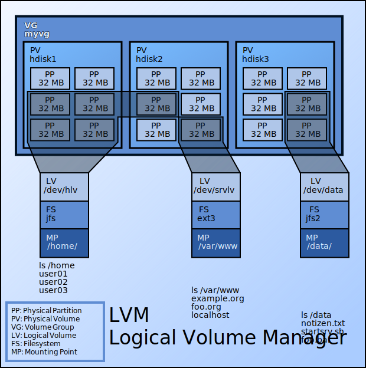

# logical volume manager (LVM)

## main usage

1. physical to logical abstraction
    * you can manage multiple disks as one logical volume
    * you can split one disk into multiple logical volumes
2. dynamic volume resizing
    * resizing logical disks
3. add more physical disks or move old physical disks for needs
    * in combination with hot swapping, you can add or replace disks without stopping the service

## conceptions

* 

1. PVs: physical volumes
    * can be hard disks or partitions
    * LVM treats each PV as a sequences of PEs(physical extends)
2. PEs: physical extends
    * PEs have a uniform size, which is the minimal storage size for LVM
3. LEs: logical extends
    * usually mapping to PEs as one to one relationship
4. VG: volume group
    * each VG is a pool of LE
    * consequently, VG consists of multiple PVs
5. LVs: logical volumes
    * LEs can be concatenated together into virtual disk partitions called LVs
    * LVs can be used as raw block devices, which is supported by Linux kernel
    * in result, we can use LVs as file systems, swap and so on

## practise

### pre-requirements

* you need to know basic [conceptions](#conceptions)
* but only PV, PE, VG and LV appear in commands

### purpose

* check volume structures after default centos 8 installation
* resize LV
    + ext filesystem
    + xfs filesystem
    + swap
* resize PV
    + will affect VG size
    + won't affect disk partition size
* create PV? VG?

### do it

1. prepare a virtual machine according to [create centos 8 with qemu](../qemu/create.centos.8.with.qemu.md)
2. check volume structures
    * use `fdisk -l` to check disks
        + ```text
          [root@node-01 ~]# fdisk -l
          Disk /dev/vda: 40 GiB, 42949672960 bytes, 83886080 sectors
          Units: sectors of 1 * 512 = 512 bytes
          Sector size (logical/physical): 512 bytes / 512 bytes
          I/O size (minimum/optimal): 512 bytes / 512 bytes
          Disklabel type: dos
          Disk identifier: 0x656b2fe0

          Device     Boot   Start      End  Sectors Size Id Type
          /dev/vda1  *       2048  2099199  2097152   1G 83 Linux
          /dev/vda2       2099200 83886079 81786880  39G 8e Linux LVM

          Disk /dev/mapper/cl_node--01-root: 36.9 GiB, 39569063936 bytes, 77283328 sectors
          Units: sectors of 1 * 512 = 512 bytes
          Sector size (logical/physical): 512 bytes / 512 bytes
          I/O size (minimum/optimal): 512 bytes / 512 bytes

          Disk /dev/mapper/cl_node--01-swap: 2.1 GiB, 2302672896 bytes, 4497408 sectors
          Units: sectors of 1 * 512 = 512 bytes
          Sector size (logical/physical): 512 bytes / 512 bytes
          I/O size (minimum/optimal): 512 bytes / 512 bytes
          ```
        + in this example
            * we have a disk `/dev/vda` whose storage size is 40G
            * the disk `/dev/vda` is split to two partitions: `/dev/vda1` and `/dev/vda2`
                1. the storage size of `/dev/vda1` is 1G
                2. the storage size of `/dev/vda2` is 39G
            * disk `/dev/mapper/cl_node--01-root` and `/dev/mapper/cl_node--01-swap` are logical partitions of LVM
    * use `df -h` to check mount points of partitions
        + ```text
          [root@node-01 ~]# df -h
          Filesystem                    Size  Used Avail Use% Mounted on
          devtmpfs                      386M     0  386M   0% /dev
          tmpfs                         405M     0  405M   0% /dev/shm
          tmpfs                         405M   11M  395M   3% /run
          tmpfs                         405M     0  405M   0% /sys/fs/cgroup
          /dev/mapper/cl_node--01-root   37G  1.7G   36G   5% /
          /dev/vda1                    1014M  198M  817M  20% /boot
          tmpfs                          81M     0   81M   0% /run/user/0
          ```
        + in this example
            * `/dev/vda1` is mounted to `/boot`
            * `/dev/mapper/cl_node--01-root` is mounted to `/`
            * but where is `/dev/mapper/cl_node--01-swap`?
                + we may guess: it's for swap according to the name
    * use `cat /proc/swaps` to check swaps
        + ```text
          [root@node-01 ~]# cat /proc/swaps
          Filename				Type		Size	Used	Priority
          /dev/dm-1                               partition	2248700	0	-2
          [root@node-01 ~]# ll /dev/mapper/cl_node--01-swap
          lrwxrwxrwx. 1 root root 7 Sep 15  2021 /dev/mapper/cl_node--01-swap -> ../dm-1
          ```
        + in this example
            * `/dev/dm-1` is used for swap
            * and `/dev/mapper/cl_node--01-swap` is a link which point to `/dev/dm-1`
    * use `vgs` to list VGs
    * use `pvs` to list VGs
    * use `lvs` to list VGs
    * demos for `vgs`, `pvs` and `lvs`
        + ```text
          [root@node-01 ~]# vgs
            VG         #PV #LV #SN Attr   VSize   VFree
            cl_node-01   1   2   0 wz--n- <39.00g    0
          [root@node-01 ~]# pvs
            PV         VG         Fmt  Attr PSize   PFree
            /dev/vda2  cl_node-01 lvm2 a--  <39.00g    0
          [root@node-01 ~]# lvs
            LV   VG         Attr       LSize  Pool Origin Data%  Meta%  Move Log Cpy%Sync Convert
            root cl_node-01 -wi-ao---- 36.85g
            swap cl_node-01 -wi-ao----  2.14g
          ```
        + in this example
            * we have one VG named `cl_node-01`
            * we have one PV created by the physical disk partition device `/dev/vda2`
            * we have two LVs named `root` and `swap`
    * use `lsblk -f` to check filesystems
        + ```text
          [root@node-01 ~]# lsblk -f
          NAME                 FSTYPE      LABEL UUID                                   MOUNTPOINT
          sr0
          vda
          |-vda1               xfs               9174c9ea-7d2e-4bd0-b179-d24010edeaf4   /boot
          `-vda2               LVM2_member       dw2bHR-OfJz-v2KZ-L6WE-LHa3-fVc1-zUZ9bF
            |-cl_node--01-root xfs               3523fb97-866b-4146-b1ae-7ed5f41da505   /
            `-cl_node--01-swap swap              792b46de-e709-4159-ae48-362e2dee609f   [SWAP]
          ```
        + in this example
            * disk `vda` is partitioned to `vda1` and `vda2`
            * the filesystem type of partition `vda1` is `xfs`
            * partition `vda2`, which is split into two LVs(`cl_node--01-root` and `cl_node--01-swap`), is `LVM2_member`
            * the filesystem type of `cl_node--01-root` is `xfs`
            * the filesystem type of `cl_node--01-swap` is `swap`
3. create PVs, VGs and LVs
    * if this machine is created by `qemu`
    * stop it
        + ```shell
          shutdown -h now
          ```
    * create another disk named `lvm.disk.qcow2`
        + ```shell
          qemu-img create -f qcow2 lvm.disk.qcow2 40G
          ```
    * start it again two disks
        + ```shell
          qemu-system-x86_64 \
              -accel kvm \
              -cpu kvm64 -smp cpus=1 \
              -m 1G \
              -drive file=$(pwd)/centos.8.qcow2,if=virtio,index=0,media=disk,format=qcow2 \
              -drive file=$(pwd)/lvm.disk.qcow2,if=virtio,index=1,media=disk,format=qcow2 \
              -rtc base=localtime \
              -pidfile $(pwd)/centos.8.qcow2.pid \
              -display none \
              -nic user,hostfwd=tcp::1022-:22 \
              -daemonize
          ```
    * use `fdisk -l` we will see another disk named `/dev/vdb`
        + ```text
          [root@node-01 ~]# fdisk -l
          ...
          Disk /dev/vdb: 40 GiB, 42949672960 bytes, 83886080 sectors
          Units: sectors of 1 * 512 = 512 bytes
          Sector size (logical/physical): 512 bytes / 512 bytes
          I/O size (minimum/optimal): 512 bytes / 512 bytes
          ...
          ```
    * use `fdisk /dev/vdb` to partition the disk named `/dev/vdb`
        + ```text
          [root@node-01 ~]# fdisk /dev/vdb

          Welcome to fdisk (util-linux 2.32.1).
          Changes will remain in memory only, until you decide to write them.
          Be careful before using the write command.

          Device does not contain a recognized partition table.
          Created a new DOS disklabel with disk identifier 0xd94b045d.
          Command (m for help): p
          Disk /dev/vdb: 40 GiB, 42949672960 bytes, 83886080 sectors
          Units: sectors of 1 * 512 = 512 bytes
          Sector size (logical/physical): 512 bytes / 512 bytes
          I/O size (minimum/optimal): 512 bytes / 512 bytes
          Disklabel type: dos
          Disk identifier: 0xd94b045d

          Command (m for help): n
          Partition type
              p   primary (0 primary, 0 extended, 4 free)
              e   extended (container for logical partitions)
          Select (default p): p
          Partition number (1-4, default 1):
          First sector (2048-83886079, default 2048):
          Last sector, +sectors or +size{K,M,G,T,P} (2048-83886079, default 83886079): +10G

          Created a new partition 1 of type 'Linux' and of size 10 GiB.

          Command (m for help): n
          Partition type
              p   primary (1 primary, 0 extended, 3 free)
              e   extended (container for logical partitions)
          Select (default p): p
          Partition number (2-4, default 2):
          First sector (20973568-83886079, default 20973568):
          Last sector, +sectors or +size{K,M,G,T,P} (20973568-83886079, default 83886079): +10G

          Created a new partition 2 of type 'Linux' and of size 10 GiB.

          Command (m for help): n
          Partition type
              p   primary (2 primary, 0 extended, 2 free)
              e   extended (container for logical partitions)
          Select (default p): p
          Partition number (3,4, default 3):
          First sector (41945088-83886079, default 41945088):
          Last sector, +sectors or +size{K,M,G,T,P} (41945088-83886079, default 83886079):

          Created a new partition 3 of type 'Linux' and of size 20 GiB.

          Command (m for help): p
          Disk /dev/vdb: 40 GiB, 42949672960 bytes, 83886080 sectors
          Units: sectors of 1 * 512 = 512 bytes
          Sector size (logical/physical): 512 bytes / 512 bytes
          I/O size (minimum/optimal): 512 bytes / 512 bytes
          Disklabel type: dos
          Disk identifier: 0xd94b045d

          Device     Boot    Start      End  Sectors Size Id Type
          /dev/vdb1           2048 20973567 20971520  10G 83 Linux
          /dev/vdb2       20973568 41945087 20971520  10G 83 Linux
          /dev/vdb3       41945088 83886079 41940992  20G 83 Linux

          Command (m for help): F
          Unpartitioned space /dev/vdb: 0 B, 0 bytes, 0 sectors
          Units: sectors of 1 * 512 = 512 bytes
          Sector size (logical/physical): 512 bytes / 512 bytes

          Command (m for help): w
          The partition table has been altered.
          Calling ioctl() to re-read partition table.
          Syncing disks.
          ```
        + in this example
            + disk `/dev/vdb` is partitioned into `/dev/vdb1`, `/dev/vdb2` and `/dev/vdb3`
            + storage size of `/dev/vdb1` is 10G
            + storage size of `/dev/vdb2` is 10G
            + storage size of `/dev/vdb3` is 20G
    * use `pvcreate` to create PVs
        + ```text
          [root@node-01 ~]# pvcreate /dev/vdb1 /dev/vdb2 /dev/vdb3
            Physical volume "/dev/vdb1" successfully created.
            Physical volume "/dev/vdb2" successfully created.
            Physical volume "/dev/vdb3" successfully created.
          [root@node-01 ~]# pvs
            PV         VG         Fmt  Attr PSize   PFree
            /dev/vda2  cl_node-01 lvm2 a--  <39.00g      0
            /dev/vdb1             lvm2 ---   10.00g  10.00g
            /dev/vdb2             lvm2 ---   10.00g  10.00g
            /dev/vdb3             lvm2 ---  <20.00g <20.00g
          ```
        + in this example
            * three PVs were created: `/dev/vdb1`, `/dev/vdb1`, `/dev/vdb1`
            * each PV bind with a disk partition
    * use `vgcreate` to create VGs
        + ```text
          [root@node-01 ~]# vgcreate vg-test /dev/vdb1 /dev/vdb2
            Volume group "vg-test" successfully created
          [root@node-01 ~]# vgs
            VG         #PV #LV #SN Attr   VSize   VFree
            cl_node-01   1   2   0 wz--n- <39.00g     0
            vg-test      2   0   0 wz--n-  19.99g 19.99g
          [root@node-01 ~]# pvs
            PV         VG         Fmt  Attr PSize   PFree
            /dev/vda2  cl_node-01 lvm2 a--  <39.00g      0
            /dev/vdb1  vg-test    lvm2 a--  <10.00g <10.00g
            /dev/vdb2  vg-test    lvm2 a--  <10.00g <10.00g
            /dev/vdb3             lvm2 ---  <20.00g <20.00g
          [root@node-01 ~]# vgextend vg-test /dev/vdb3
            Volume group "vg-test" successfully extended
          [root@node-01 ~]# pvs
            PV         VG         Fmt  Attr PSize   PFree
            /dev/vda2  cl_node-01 lvm2 a--  <39.00g      0
            /dev/vdb1  vg-test    lvm2 a--  <10.00g <10.00g
            /dev/vdb2  vg-test    lvm2 a--  <10.00g <10.00g
            /dev/vdb3  vg-test    lvm2 a--  <20.00g <20.00g
          [root@node-01 ~]# vgreduce vg-test /dev/vdb2
            Removed "/dev/vdb2" from volume group "vg-test"
          [root@node-01 ~]# pvs
            PV         VG         Fmt  Attr PSize   PFree
            /dev/vda2  cl_node-01 lvm2 a--  <39.00g      0
            /dev/vdb1  vg-test    lvm2 a--  <10.00g <10.00g
            /dev/vdb2             lvm2 ---   10.00g  10.00g
            /dev/vdb3  vg-test    lvm2 a--  <20.00g <20.00g
          [root@node-01 ~]# vgextend vg-test /dev/vdb2
            Volume group "vg-test" successfully extended
          [root@node-01 ~]# pvs
            PV         VG         Fmt  Attr PSize   PFree
            /dev/vda2  cl_node-01 lvm2 a--  <39.00g      0
            /dev/vdb1  vg-test    lvm2 a--  <10.00g <10.00g
            /dev/vdb2  vg-test    lvm2 a--  <10.00g <10.00g
            /dev/vdb3  vg-test    lvm2 a--  <20.00g <20.00g
          ```
        + in this example
            * a VG named `vg-test` was created
            * `vg-test` consists of two PVs(`/dev/vdb1` and `/dev/vdb2`)
            * `/dev/vdb3` was added into VG named `vg-test` by `vgextend`
            * `/dev/vdb2` was removed from VG named `vg-test` by `vgreduce`
            * finally, `/dev/vdb2` was added into VG named `vg-test` by `vgextend`
    * use `lvcreate` to create LVs
        + ```text
          [root@node-01 ~]# lvcreate -L 5G -n small vg-test
            Logical volume "small" created.
          [root@node-01 ~]# lvcreate -L 10G -n medium vg-test
            Logical volume "medium" created.
          [root@node-01 ~]# lvcreate -L 24G -n large vg-test
            Logical volume "large" created.
          [root@node-01 ~]# lvs
            LV     VG         Attr       LSize  Pool Origin Data%  Meta%  Move Log Cpy%Sync Convert
            root   cl_node-01 -wi-ao---- 36.85g
            swap   cl_node-01 -wi-ao----  2.14g
            large  vg-test    -wi-a----- 24.00g
            medium vg-test    -wi-a----- 10.00g
            small  vg-test    -wi-a-----  5.00g
          [root@node-01 ~]# lsblk -f
          NAME                 FSTYPE      LABEL UUID                                   MOUNTPOINT
          sr0
          vda
          |-vda1               xfs               9174c9ea-7d2e-4bd0-b179-d24010edeaf4   /boot
          `-vda2               LVM2_member       dw2bHR-OfJz-v2KZ-L6WE-LHa3-fVc1-zUZ9bF
            |-cl_node--01-root xfs               3523fb97-866b-4146-b1ae-7ed5f41da505   /
            `-cl_node--01-swap swap              792b46de-e709-4159-ae48-362e2dee609f   [SWAP]
          vdb
          |-vdb1               LVM2_member       hqHssd-JnW3-kax3-qcHe-8YOe-5akf-6coSxT
          | |-vg--test-small
          | `-vg--test-large
          |-vdb2               LVM2_member       yrvWiP-A0sR-SVvN-znwh-dFXK-2BLV-q8zIsU
          | `-vg--test-large
          `-vdb3               LVM2_member       QgObUx-rH0u-VzKo-eyfB-yOrL-sv0F-Jxag0B
            |-vg--test-medium
            `-vg--test-large
          [root@node-01 ~]# fdisk -l
          ...
          Disk /dev/mapper/vg--test-small: 5 GiB, 5368709120 bytes, 10485760 sectors
          ...
          Disk /dev/mapper/vg--test-medium: 10 GiB, 10737418240 bytes, 20971520 sectors
          ...
          Disk /dev/mapper/vg--test-large: 24 GiB, 25769803776 bytes, 50331648 sectors
          ...
          ```
        + in this example
            * we create a LV named `small`, whose storage size is 5G
            * we create a LV named `medium`, whose storage size is 10G
            * we create a LV named `large`, whose storage size is 24G
            * LV named `small` is mapped to `/dev/mapper/vg--test-small`
            * LV named `medium` is mapped to `/dev/mapper/vg--test-medium`
            * LV named `large` is mapped to `/dev/mapper/vg--test-large`
    * use `mkfs.xfs` to make `xfs` filesystem for `/dev/mapper/vg--test-small` and `/dev/mapper/vg--test-large`
        + ```shell
          mkfs.xfs /dev/mapper/vg--test-small 
          mkfs.xfs /dev/mapper/vg--test-large
          ```
    * use `mkfs.ext4` to make `xfs` filesystem for `/dev/mapper/vg--test-medium`
        + ```shell
          mkfs.ext4 /dev/mapper/vg--test-medium
          ```
    * filesystems can be mounted into any path
        + ```shell
          mkdir -p /mnt/small && mount /dev/mapper/vg--test-small /mnt/small
          mkdir -p /mnt/medium && mount /dev/mapper/vg--test-medium /mnt/medium
          mkdir -p /mnt/large && mount /dev/mapper/vg--test-large /mnt/large
          ```
        + ```text
          [root@node-01 ~]# df -h
          Filesystem                    Size  Used Avail Use% Mounted on
          devtmpfs                      386M     0  386M   0% /dev
          tmpfs                         405M     0  405M   0% /dev/shm
          tmpfs                         405M   11M  395M   3% /run
          tmpfs                         405M     0  405M   0% /sys/fs/cgroup
          /dev/mapper/cl_node--01-root   37G  1.7G   36G   5% /
          /dev/vda1                    1014M  198M  817M  20% /boot
          tmpfs                          81M     0   81M   0% /run/user/0
          /dev/mapper/vg--test-small    5.0G   68M  5.0G   2% /mnt/small
          /dev/mapper/vg--test-medium   9.8G   37M  9.3G   1% /mnt/medium
          /dev/mapper/vg--test-large     24G  204M   24G   1% /mnt/large
          ```
4. resize LV of xfs filesystem
    * xfs filesystem itself not support resize
    * and it's not possible for us to umount `/dev/mapper/cl_node--01-root` as it is mounted to `/`
    * consequently, we need to use another disk
    * resize LV of xfs filesystem by re-create it
        + ```text
          [root@node-01 ~]# umount /dev/mapper/vg--test-large
          [root@node-01 ~]# lvremove /dev/mapper/vg--test-large
          Do you really want to remove active logical volume vg-test/large? [y/n]: y
            Logical volume "large" successfully removed
          [root@node-01 ~]# lvcreate -L 18G -n large vg-test
          WARNING: xfs signature detected on /dev/vg-test/large at offset 0. Wipe it? [y/n]: y
            Wiping xfs signature on /dev/vg-test/large.
            Logical volume "large" created.
          [root@node-01 ~]# mkfs.xfs /dev/mapper/vg--test-large
          ...
          [root@node-01 ~]# mount /dev/mapper/vg--test-large /mnt/large
          [root@node-01 ~]# umount /dev/mapper/vg--test-small
          [root@node-01 ~]# lvremove /dev/mapper/vg--test-small
          Do you really want to remove active logical volume vg-test/small? [y/n]: y
            Logical volume "small" successfully removed
          [root@node-01 ~]# lvcreate -L 11G -n small vg-test
          WARNING: xfs signature detected on /dev/vg-test/small at offset 0. Wipe it? [y/n]: y
            Wiping xfs signature on /dev/vg-test/small.
            Logical volume "small" created.
          [root@node-01 ~]# mkfs.xfs /dev/mapper/vg--test-small
          ...
          [root@node-01 ~]# mount /dev/mapper/vg--test-small /mnt/small
          [root@node-01 ~]# df -h
          ...
          /dev/mapper/vg--test-medium   9.8G   37M  9.3G   1% /mnt/medium
          /dev/mapper/vg--test-large     18G  161M   18G   1% /mnt/large
          /dev/mapper/vg--test-small     11G  111M   11G   1% /mnt/small
          ```
        + in this example
            * `/dev/mapper/vg--test-large` resized from 24G to 18G
            * `/dev/mapper/vg--test-small` resized from 5G to 11G
            * **NOTE**: the data will be loss, you should backup the data and restore it back in production environment
5. resize LV of ext4 filesystem
    * ext4 filesystem itself is resizable
    * resize `/dev/mapper/vg--test-medium`
        + ```shell
          umount /dev/mapper/vg--test-medium
          e2fsck -f /dev/mapper/vg--test-medium
          resize2fs /dev/mapper/vg--test-medium 3G
          lvreduce -L 3G /dev/mapper/vg--test-medium
          e2fsck /dev/mapper/vg--test-medium
          mount /dev/mapper/vg--test-medium /mnt/medium 
          ```
        + ```text
          [root@node-01 ~]# df -h
          ...
          /dev/mapper/vg--test-large     18G  161M   18G   1% /mnt/large
          /dev/mapper/vg--test-small     11G  111M   11G   1% /mnt/small
          /dev/mapper/vg--test-medium   2.9G   25M  2.8G   1% /mnt/medium
          ```
        + ```shell
          umount /dev/mapper/vg--test-medium
          e2fsck -f /dev/mapper/vg--test-medium
          lvextend -L +3G /dev/mapper/vg--test-medium
          # without size, the partition be extend with all the space
          resize2fs /dev/mapper/vg--test-medium
          e2fsck /dev/mapper/vg--test-medium
          mount /dev/mapper/vg--test-medium /mnt/medium
          ```
6. now you can image the case
    * add or remove PVs in VGs
    * then resize the filesystem online
    * or replace the hardware disks online(need `pvmove` which will be introduced another time)
